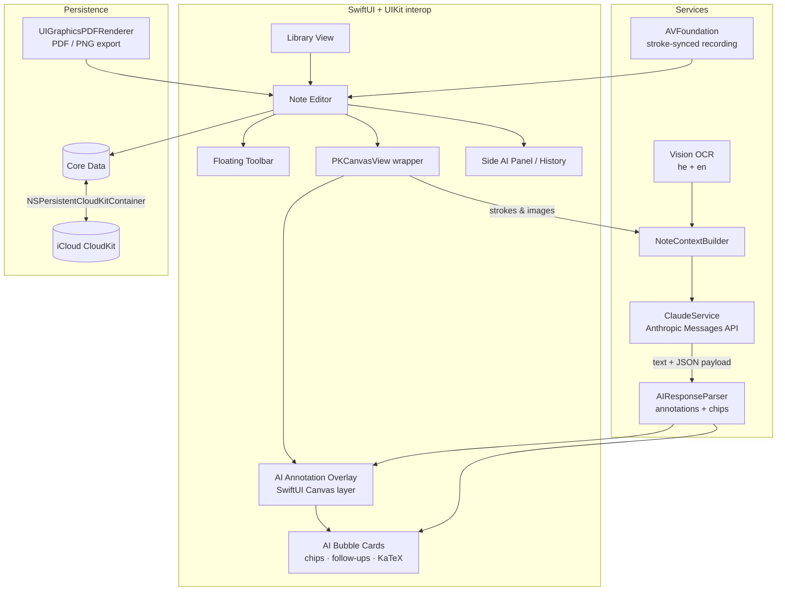

# StudyInk 🖋️

**An AI-powered iPad note-taking app — Notability parity plus a Claude-powered tutor that lives on the canvas.**

StudyInk is a native iPad app built in SwiftUI for a university student studying **Calculus 1** and **Discrete Mathematics 1**. It replicates the core Notability experience (PencilKit canvas, templates, library, audio-synced notes, iCloud sync) and extends it with a deeply integrated AI tutor powered by the **Anthropic Claude API**. The AI sees the whole note — every page, every stroke, every typed word — and answers **directly on the canvas**, anchored to the content that triggered the question, like a tutor writing next to you.

Full **Hebrew + RTL** support throughout: handwriting OCR, typed text, UI mirroring, and RTL AI bubbles. Polished **dark mode** matching Notability's aesthetic.

## Screenshots

> 📸 _Screenshots coming soon — placeholder section._

| Canvas + AI bubble | Library | Dark mode | Hebrew RTL |
|---|---|---|---|
| _TBD_ | _TBD_ | _TBD_ | _TBD_ |

## Features

### Note-taking engine (Notability parity)
- Infinite vertical canvas with **PencilKit**: pressure, tilt, palm rejection
- Tools: ballpoint / fountain / monoline pens, blending highlighter, textured pencil, object + pixel eraser, lasso, ruler
- Custom color picker, opacity & stroke width sliders, unlimited undo/redo
- Typed text boxes anywhere on canvas — fonts, styles, colors, **RTL auto-detected for Hebrew**
- Multi-page documents, thumbnail strip, add/delete/reorder/duplicate pages
- Templates: blank, ruled (wide/college/narrow), dot grid, square grid, isometric, music staff, Cornell — plus **custom PDF templates**, per-page backgrounds, dark-mode-aware rendering
- Media: images (Photos/camera/Files), inline PDF annotation, stickers, VisionKit document scanner, drag & drop
- Floating repositionable toolbar, customizable tool set, distraction-free mode, Split View / Slide Over
- Library: subjects (folders) with colors and nesting, dividers, drag-to-organize, sort, **full-text + handwriting OCR search (Hebrew, Latin, math)**
- Continuous auto-save, Core Data + **iCloud CloudKit sync**, export to PDF/PNG
- **Audio recording synced to writing** — tap a word to jump to that moment

### Contextual AI on the canvas (the core innovation)
- AI responses appear as **floating bubble cards on the canvas**, spatially anchored to the circled region / last stroke / cursor
- Claude returns structured annotations the app draws on an overlay: **highlights, hand-drawn-style circles, arrows, underlines** — matched to OCR text and animated in
- **Ask More**: quick-reply chips + inline follow-up field inside every bubble; threads grow in place
- Pin bubbles to the page, dismiss to AI History, drag to reposition, "insert answer into note"
- Modes: **Circle & Ask**, proactive **Guided Mode**, **Explain This Page**, **Quiz Me**
- Side AI panel (320 pt drawer) as a secondary reading surface, KaTeX math rendering with dark-mode CSS
- Claude responds **in the student's language** — Hebrew questions get Hebrew answers, RTL bubbles

## Setup

### Requirements
- **Xcode 16.0+** (project uses the synchronized-folder project format)
- **iPadOS 17.0+** deployment target, iPad only
- An **Anthropic API key** — get one at <https://console.anthropic.com>

### API key configuration
Keys are **never hardcoded or committed**. Copy the sample config and add your key(s):

```bash
cp StudyInk/Config.sample.plist StudyInk/Config.plist
# then edit StudyInk/Config.plist:
#   ANTHROPIC_API_KEY — from console.anthropic.com (paid credits)
#   GEMINI_API_KEY    — from aistudio.google.com (free tier available)
```

`StudyInk/Config.plist` is listed in `.gitignore`. If no key is configured the app runs with AI features disabled and shows a setup hint in Settings.

### AI provider & model
The tutor supports **two providers — Anthropic Claude and Google Gemini** — selected in **Settings → AI Tutor**, along with the model. "Load Available Models" fetches the live model list from the selected provider's API; a custom model ID can also be entered. Notes on cost:

- Claude API usage is billed via Console credits (a Claude Pro subscription does **not** cover API calls). For cheap iteration use `claude-haiku-4-5`; for best quality use `claude-fable-5`.
- Gemini keys from Google AI Studio include a **free tier** — handy for zero-cost testing.

### iCloud entitlements
1. In **Signing & Capabilities**, select your team.
2. The entitlements file ships empty so the app builds without a paid team. To enable sync, add the **iCloud → CloudKit** capability in Signing & Capabilities with container `iCloud.com.studyink.app` (or your own ID — then also update `PersistenceController.cloudKitContainerID`).
3. Turn on **Settings → iCloud Sync** inside the app and relaunch; the store is shared, so no data is lost when toggling.
4. Background Modes → Remote notifications is enabled in Info.plist for CloudKit push.

### Build & run
Open `StudyInk.xcodeproj`, select an iPad simulator or device, and run. No third-party dependencies — everything is Apple-native.

## Architecture



| Layer | Technology |
|---|---|
| UI | SwiftUI + UIKit interop |
| Canvas | PencilKit (`PKCanvasView`, `PKDrawing`) |
| AI annotation overlay | SwiftUI `Canvas` layer above PKCanvasView (canvas-space coordinates) |
| Handwriting OCR | Vision `VNRecognizeTextRequest` (`["he", "en"]`) |
| PDF | PDFKit |
| Persistence | Core Data + iCloud CloudKit |
| AI | Anthropic Claude API (multimodal) via `URLSession` |
| Math rendering | KaTeX in `WKWebView`, dark-mode aware CSS |
| Camera / scan | VisionKit |
| Audio | AVFoundation |
| Export | `UIGraphicsPDFRenderer` |
| Localization | `he.lproj` + `en.lproj` `Localizable.strings` |
| Dark mode | Semantic color asset catalog + `@Environment(\.colorScheme)` |

## Roadmap

- [x] **Phase 0** — Repo setup, README, Xcode scaffold
- [x] **Phase 1** — Canvas, PencilKit, toolbar, local save (`feature/phase-1-canvas`)
- [x] **Phase 2** — Templates, media, PDF, typed text, RTL (`feature/phase-2-templates`)
- [x] **Phase 3** — Library, folders, Hebrew OCR search, export (`feature/phase-3-library`)
- [x] **Phase 4** — Dark mode full implementation (`feature/phase-4-darkmode`)
- [x] **Phase 5** — AI bubble system, canvas annotations, chips (`feature/phase-5-ai-bubbles`)
- [x] **Phase 6** — Circle & Ask, Guided Mode, Quiz Me (`feature/phase-6-ai-modes`)
- [x] **Phase 7** — Hebrew AI responses, RTL bubbles (`feature/phase-7-hebrew-ai`)
- [x] **Phase 8** — iCloud sync, audio, polish, accessibility (`feature/phase-8-sync-polish`)

Workflow: every phase is developed on its feature branch and merged into `dev` via PR; `main` receives stable releases from `dev`. Commits follow [Conventional Commits](https://www.conventionalcommits.org).

## License

[MIT](LICENSE)
